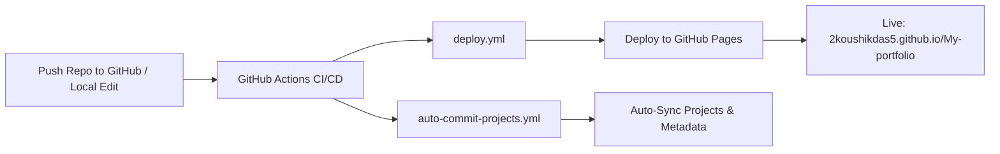

<div align="center">

```text
   ______     __               ____             __                  
  / ____/_  __/ /_  ___  _____/ __ \____  _____/ /_____  ____  _____
 / /   / / / / __ \/ _ \/ ___/ /_/ / __ \/ ___/ //_/ _ \/ __ \/ ___/
/ /___/ /_/ / /_/ /  __/ /  / ____/ /_/ / /  / ,< /  __/ /_/ / /    
\____/\__, /_.___/\___/_/  /_/    \____/_/  /_/|_|\___/\____/_/     
     /____/       [ KOUSHIK DAS - CYBER DEFENSE PORTFOLIO ]         
```

# 🛡️ KOUSHIK DAS // CYBERSECURITY & ETHICAL HACKING PORTFOLIO

[](https://2koushikdas5.github.io/My-portfolio)
[](https://github.com/2koushikdas5)
[](https://2koushikdas5.github.io/My-portfolio)
[](LICENSE)

<p align="center">
  <strong>High-Performance, Futuristic Cyber Defense & Offensive Security Portfolio with Dynamic GitHub REST API Auto-Sync & Automation.</strong>
</p>

[🌐 View Live Portfolio](https://2koushikdas5.github.io/My-portfolio) • [🛠️ Interactive Terminal](https://2koushikdas5.github.io/My-portfolio#terminal-section) • [🔑 Crypto Playground](https://2koushikdas5.github.io/My-portfolio#tools-section) • [📬 Encrypted Contact](https://2koushikdas5.github.io/My-portfolio#contact)

---

</div>

## 🎯 Profile Dossier

- **Operator**: Koushik Das
- **Designation**: Cybersecurity Student & Security Researcher
- **Specialization**: Ethical Hacking, Web Application Pentesting (OWASP Top 10), Network Defense, and SOC Telemetry
- **GitHub Alias**: [@2koushikdas5](https://github.com/2koushikdas5)
- **Status**: `ONLINE // MONITORING SYSTEMS`
- **Core Mission**: Uncovering vulnerabilities, understanding attack lifecycles, and hardening digital architectures.

---

## ⚡ Key Technical Capabilities & Arsenal

<div align="center">

| Domain | Tools & Technologies | Focus Areas |
| :--- | :--- | :--- |
| **Offensive Security** | `Burp Suite`, `Nmap`, `Metasploit`, `Gobuster`, `SQLMap` | OWASP Top 10, SQLi, XSS, CSRF, IDOR, Reconnaissance |
| **Defensive & SOC** | `Wireshark`, `TCPDump`, `Splunk`, `Wazuh`, `Snort` | Packet Triage, PCAP Analysis, Log Aggregation, IDS/IPS |
| **System Hardening** | `Linux / Kali`, `iptables`, `UFW`, `auditd`, `SSH Hardening` | PAM Policies, Least Privilege Architecture, Firewalls |
| **Scripting & Dev** | `Python`, `Bash`, `PowerShell`, `JavaScript`, `Sockets` | Exploit Automation, Scapy Packet Crafting, Web Scrapers |
| **Cryptography** | `AES-256-GCM`, `RSA`, `SHA-256`, `PBKDF2`, `PKI / TLS` | Symmetric/Asymmetric Ciphers, Entropy, Integrity |

</div>

---

## 🖥️ Live Features in This Portfolio

1. **Interactive Cyber Terminal (Bash CLI)**
   - Fully interactive Linux/Hacker command prompt embedded right in the browser.
   - Type `help`, `whoami`, `skills`, `projects`, `nmap 192.168.1.1`, `hash <text>`, `b64 <text>`, or probe for the secret CTF flag with `cat flag.txt`!

2. **In-Browser Cryptographic Tools Playground**
   - **Base64 / Hex Transformer**: Instant encode/decode with one-click clipboard copying.
   - **Web Crypto API SHA-256 Generator**: Native browser cryptographic hashing.
   - **Password Entropy & Strength Analyzer**: Real-time bit-entropy estimation.

3. **Dynamic Live GitHub API Synchronizer**
   - Directly queries `https://api.github.com/users/2koushikdas5/repos`.
   - **Whenever you push a new repository to your GitHub account, it instantly appears on your live portfolio without editing any code!**

4. **Telemetry HUD & CRT Scanline Aesthetics**
   - Real-time DEFCON status, TLS 1.3 protocol indicator, live UTC clock, and session uptime counter.
   - Matrix digital rain canvas with speed-boost easter egg.
   - Web Audio API Cyber Synthesizer (futuristic audio feedback on clicks and commands).

---

## 🔄 Automation & Auto-Commit System

This repository is built with an automated CI/CD engine:



### 1. Push Updates with One Command (PowerShell)
Whenever you make updates locally, run:
```powershell
.\scripts\push_project.ps1 "Added new vulnerability lab"
```
*(If you omit the message, a timestamped commit is created automatically!)*

### 2. Push Updates with One Command (Bash)
```bash
./scripts/push_project.sh "Added new CTF writeup"
```

### 3. GitHub Actions Workflows
* [`.github/workflows/deploy.yml`](.github/workflows/deploy.yml) — Automatically builds and deploys your website to GitHub Pages on every push to `main`.
* [`.github/workflows/auto-commit-projects.yml`](.github/workflows/auto-commit-projects.yml) — Automated daily bot that checks for new repositories and commits metadata back to GitHub.

---

## 🚀 How to Enable GitHub Pages

To make your website live on `https://2koushikdas5.github.io/My-portfolio`:

1. Open your repository settings:
   👉 **[https://github.com/2koushikdas5/My-portfolio/settings/pages](https://github.com/2koushikdas5/My-portfolio/settings/pages)**
2. Under **Build and deployment > Source**, select **"GitHub Actions"**.
3. Under the **Actions** tab on GitHub, re-run the `Deploy Cybersecurity Portfolio to GitHub Pages` workflow.
4. Your website will be live at:
   **`https://2koushikdas5.github.io/My-portfolio`**

---

## 📁 Repository File Structure

```text
My-portfolio/
├── .github/
│   └── workflows/
│       ├── deploy.yml                 # Auto-deploys site to GitHub Pages on push
│       └── auto-commit-projects.yml   # Auto-syncs repos and commits updates on GitHub
├── css/
│   └── style.css                      # Cyber-defense cyberpunk styling & animations
├── js/
│   ├── crypto-tools.js                # Base64, Hex, SHA-256 Web Crypto API, Entropy tool
│   ├── terminal.js                    # Interactive bash terminal CLI simulation
│   └── main.js                        # Matrix rain canvas, live GitHub sync, sound synth
├── scripts/
│   ├── push_project.ps1               # 1-command auto-commit & push script (PowerShell)
│   └── push_project.sh                # 1-command auto-commit & push script (Bash)
├── index.html                         # Semantic, accessible HTML5 cyber portfolio
└── README.md                          # Repository documentation and guide
```

---

<div align="center">

### 📬 Establish Communication Handshake

[](https://github.com/2koushikdas5)
[](mailto:koushikdas.cybersec@gmail.com)

**PGP Fingerprint**: `9B4F 3A21 C78E D012 449A 55BC 10F8 62A3 2K9D 2026`

*© 2026 Koushik Das. All systems operational.*

</div>
